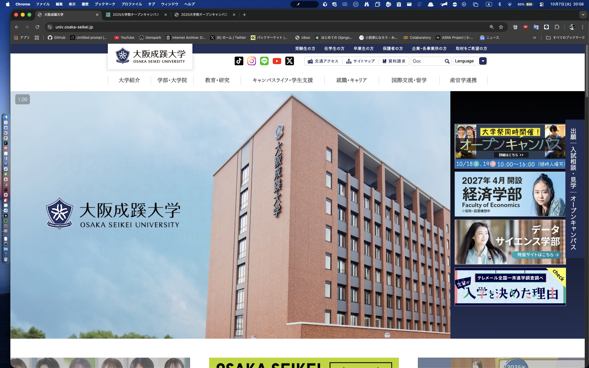
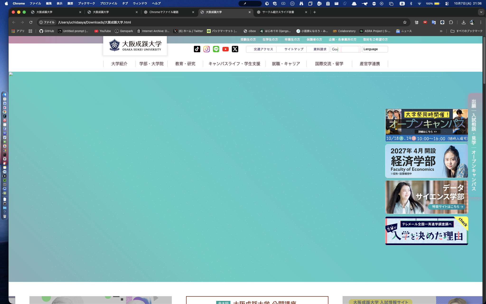
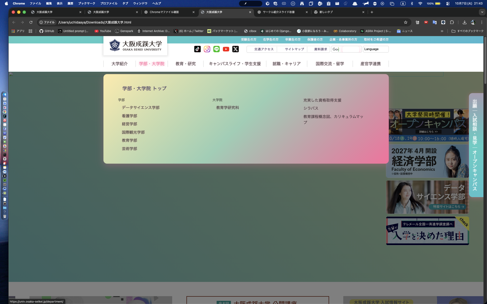

<!--
headingDivider: 1
-->

# せいけいデジタルサークル
# 目次
1. 自己・サークル紹介
1. 質問
1. 大学HPで遊ぼう
1. 終わりに

# 自己・サークル紹介
* 経営学部経営学科
* せいけいデジタルサークル部長　
* 4回生内田絢汰

1. 2回生3月に当サークルを**立ち上げ**
1. 3回生10月に**初のスタンプラリーアプリ**を作成
1. 3回生3月に**他部活のHP**の作成
1. 現在「ASRA」アプリを**鋭意製作中**

# 質問

## 皆さんはすでにスタンプラリーに参加していますか？

1. 参加しています
2. 参加していません

# なぜこの質問をしたのか
- わたしたちが<u>作成したもの</u>だからです

# 大学HPで遊ぼう
# 突然ですが,,,
- 皆さん本日のオープンキャンパスは何で知りましたか？
    - SNS
    - 大学のHP
    - その他

# 今日はこのHPを使います

# 注意
- 苦手な方は画面を見ないようにお願いします

# 使用コード

~~~
cd 
cd /Users/uchidaaya/Downloads/大阪成蹊大学_files/ 
ls
ls ~/Downloads | grep .html
 open -a "Google Chrome" ~/Downloads/大阪成蹊大学.html
~~~

# 今日<u>からは</u>このHPを使います
 [alt text](oc_20251018.md)
# 今日<u>からは</u>このHPを使います

# 終わりに
- プログラミングは専門性が高い？！
- どんな学部に入ったとしても、やりたいと思ったら行える環境を当サークルでは整えております